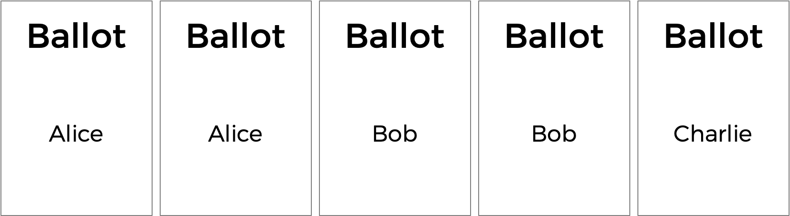
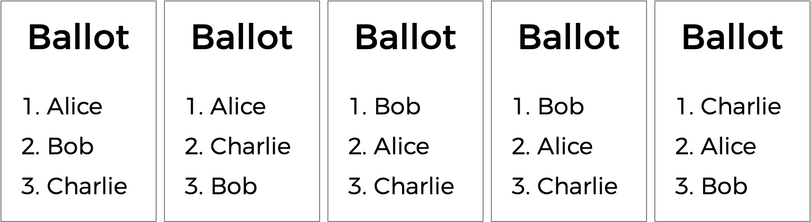
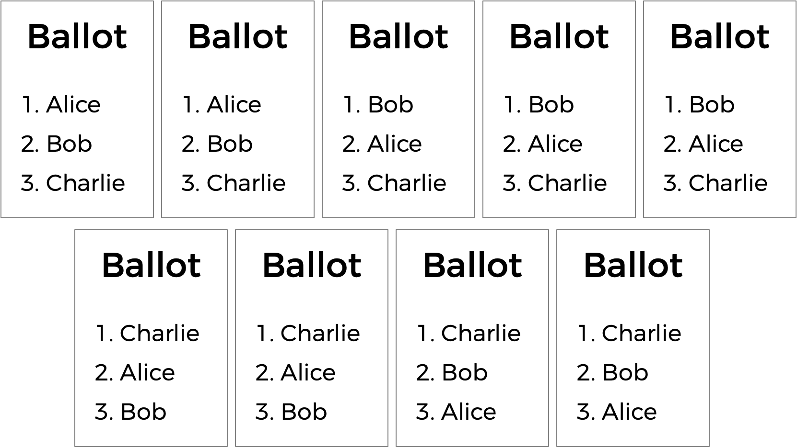

# Runoff

You already know about plurality elections, which follow a very simple algorithm for determining the winner of an election: every voter gets one vote, and the candidate with the most votes wins.

But the plurality vote does have some disadvantages. What happens, for instance, in an election with three candidates, and the ballots below are cast?



A plurality vote would here declare a tie between Alice and Bob, since each has two votes. But is that the right outcome?

There’s another kind of voting system known as a ranked-choice voting system. In a ranked-choice system, voters can vote for more than one candidate. Instead of just voting for their top choice, they can rank the candidates in order of preference. The resulting ballots might therefore look like the below.



Here, each voter, in addition to specifying their first preference candidate, has also indicated their second and third choices. And now, what was previously a tied election could now have a winner. The race was originally tied between Alice and Bob, so Charlie was out of the running. But the voter who chose Charlie preferred Alice over Bob, so Alice could here be declared the winner.

Ranked choice voting can also solve yet another potential drawback of plurality voting. Take a look at the following ballots.



Who should win this election? In a plurality vote where each voter chooses their first preference only, Charlie wins this election with four votes compared to only three for Bob and two for Alice. But a majority of the voters (5 out of the 9) would be happier with either Alice or Bob instead of Charlie. By considering ranked preferences, a voting system may be able to choose a winner that better reflects the preferences of the voters.

One such ranked choice voting system is the instant runoff system. In an instant runoff election, voters can rank as many candidates as they wish. If any candidate has a majority (more than 50%) of the first preference votes, that candidate is declared the winner of the election.

If no candidate has more than 50% of the vote, then an “instant runoff” occurrs. The candidate who received the fewest number of votes is eliminated from the election, and anyone who originally chose that candidate as their first preference now has their second preference considered. Why do it this way? Effectively, this simulates what would have happened if the least popular candidate had not been in the election to begin with.

The process repeats: if no candidate has a majority of the votes, the last place candidate is eliminated, and anyone who voted for them will instead vote for their next preference (who hasn’t themselves already been eliminated). Once a candidate has a majority, that candidate is declared the winner.

Sounds a bit more complicated than a plurality vote, doesn’t it? But it arguably has the benefit of being an election system where the winner of the election more accurately represents the preferences of the voters. In a file called runoff.c in a folder called runoff, create a program to simulate a runoff election.

## Distribution Code
Log into cs50.dev, click on your terminal window, and execute ```cd``` by itself. You should find that your terminal window’s prompt resembles the below:
```
$
```
Next execute
```
wget https://cdn.cs50.net/2024/fall/psets/3/runoff.zip
````
in order to download a ZIP called ```runoff.zip``` into your codespace.

Then execute
```
unzip runoff.zip
````
to create a folder called ```runoff```. You no longer need the ZIP file, so you can execute
```
rm runoff.zip
````
and respond with “y” followed by Enter at the prompt to remove the ZIP file you downloaded.

Now type
```
cd runoff
````
followed by Enter to move yourself into (i.e., open) that directory. Your prompt should now resemble the below.
```
runoff/ $
```
If all was successful, you should execute
```
ls
````
and see a file named ```runoff.c```. Executing ```code runoff.c``` should open the file where you will type your code for this problem set. If not, retrace your steps and see if you can determine where you went wrong!

## Understand the code in ```runoff.c```
Whenever you’ll extend the functionality of existing code, it’s best to be sure you first understand it in its present state.

Look at the top of ```runoff.c``` first. Two constants are defined: ```MAX_CANDIDATES``` for the maximum number of candidates in the election, and ```MAX_VOTERS``` for the maximum number of voters in the election.
```
// Max voters and candidates
#define MAX_VOTERS 100
#define MAX_CANDIDATES 9
````
Notice that MAX_CANDIDATES is used to size an array, candidates.
```
// Array of candidates
candidate candidates[MAX_CANDIDATES];
```

```candidates``` is an array of ```candidates```. In ```runoff.c``` a ```candidate``` is a ```struct```. Every candidate has a ```string``` field for their ```name```, an ```int``` representing the number of ```votes``` they currently have, and a ```bool``` value called ```eliminated``` that indicates whether the candidate has been eliminated from the election. The array candidates will keep track of all of the candidates in the election.
```
// Candidates have name, vote count, eliminated status
typedef struct
{
    string name;
    int votes;
    bool eliminated;
}
candidate;
```
Now you can better understand preferences, the two-dimensional array. The array ```preferences[i]``` will represent all of the preferences for voter number ```i```. The integer, ```preferences[i][j]```, will store the index of the candidate, from the candidates array, who is the ```j```th preference for voter ```i```.
```
// preferences[i][j] is jth preference for voter i
int preferences[MAX_VOTERS][MAX_CANDIDATES];
````
The program also has two global variables: ```voter_count``` and ```candidate_count```.
```
// Numbers of voters and candidates
int voter_count;
int candidate_count;
```
Now onto ```main```. Notice that after determining the number of candidates and the number of voters, the ```main``` voting loop begins, giving every voter a chance to vote. As the voter enters their preferences, the vote function is called to keep track of all of the preferences. If at any point, the ballot is deemed to be invalid, the program exits.

Once all of the votes are in, another loop begins: this one’s going to keep looping through the runoff process of checking for a winner and eliminating the last place candidate until there is a winner.

The first call here is to a function called ```tabulate```, which should look at all of the voters’ preferences and compute the current vote totals, by looking at each voter’s top choice candidate who hasn’t yet been eliminated. Next, the ```print_winner``` function should print out the winner if there is one; if there is, the program is over. But otherwise, the program needs to determine the fewest number of votes anyone still in the election received (via a call to ```find_min```). If it turns out that everyone in the election is tied with the same number of votes (as determined by the ```is_tie``` function), the election is declared a tie; otherwise, the last-place candidate (or candidates) is eliminated from the election via a call to the eliminate function.

If you look a bit further down in the file, you’ll see that the rest of the functions—- ```vote```, ```tabulate```, ```print_winner```, ```find_min```, ```is_tie```, and ```eliminate```-—are all left to up to you to complete! You should only modify these functions in ```runoff.c```, though you may ```#include additional header files atop runoff.c``` if you’d like

## How to Test
Be sure to test your code to make sure it handles…

- An election with any number of candidate (up to the ```MAX``` of ```9```)
- Voting for a candidate by name
- Invalid votes for candidates who are not on the ballot
- Printing the winner of the election if there is only one
- Not eliminating anyone in the case of a tie between all remaining candidates

## Correctness
```
check50 cs50/problems/2025/x/runoff
````

## Style
```
style50 runoff.c
```

## How to Submit
```
submit50 cs50/problems/2025/x/runoff
```
